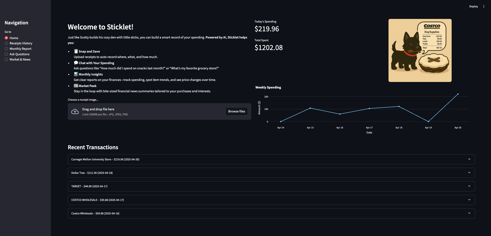
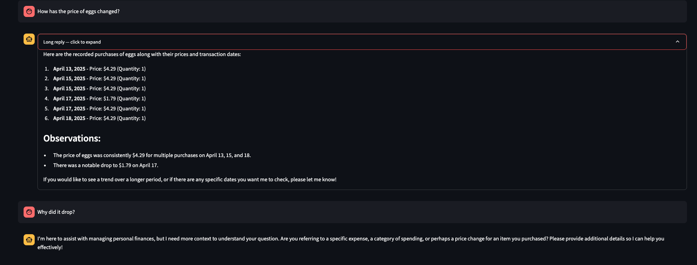

# 🌿 Sticklet: A Personal Receipt Journal 🐶


<p align="center">
  <strong>✍️ Authors ✍️</strong><br>
  <strong>Fanxing Bu</strong> &nbsp;|&nbsp; <strong>Ivan Wiryadi</strong><br>
  🎓 Carnegie Mellon University 🎓
</p>

---

## ⚠️ Disclaimer
This repository contains a prototype developed for a course project. It is intended for educational and experimental purposes only. It **must not** be relied upon for actual financial decision-making or investment use. It is **not** production-ready.


---

## 🚀 Introduction
Every time Scotty goes out to play, he brings home a little stick. Each stick is a memory—a tiny story in his daily journal.

Just like that, every time **you go out shopping**, you can bring back a **receipt**—your own little “stick.” Sticklet lets you upload an image of that receipt, and in return:
- It records **where** you shopped,
- **what** you bought,
- and **how much** you paid.

It can even suggest recipes, track prices over time, summarize your spending, and more.

✨ Start building Scotty’s little nest—one stick (receipt) at a time.

---

## 📚 Project Overview
Sticklet is a **multi-agent, AI-powered personal financial assistant** that manages and analyzes your shopping receipts. Using OCR, LLM agents, memory systems, and a modular toolchain, it provides:

- 🧾 Automated receipt parsing
- 📊 Monthly expense summaries
- 🧠 Persistent memory and insights
- 🗞️ Market news contextualized to your habits
- 💬 Natural language querying

Built with [LangChain](https://www.langchain.com/), [Mistral AI](https://mistral.ai/), and [Streamlit](https://streamlit.io/), this prototype showcases multi-modal reasoning and tool use in personal finance.

---

## 🧱 Project Structure
```
agentic-project/
├── app.py                     # Main app entry point
├── data/                      # Storage layer
├── src/
│   ├── agents/                # Autonomous agents
│   ├── tools/                 # OCR, memory, news tools
│   └── utils/                 # Utilities and memory
├── streamlit_app/            # Frontend (Streamlit)
└── tests/                    # Unit tests and sample receipts
```

---

## 🧠 Core Components
### 🤖 Agents
- **Coordinator Agent**: Delegates user tasks to others
- **Receipt Reader Agent**: OCR + parsing
- **Monthly Report Agent**: Spending summaries
- **Market Agent**: News retrieval & summarization

### 🛠 Tools
- `receipt_tools.py`: Mistral OCR + structured parsing
- `memory_tools.py`: Purchase memory and insights
- `receipt_processor_tool.py`: Validation & storage
- `fetch_market_data.py`: Pulls financial market data

### 💾 Memory System
- `Purchase` and `PurchaseItem` schemas
- Filters by date, category, merchant
- Shared LangChain memory for agents

---

## 💡 Why LangChain, Mistral, and OpenAI?
- **LangChain**: Tool-using agents, memory, and prompt templates
- **Mistral**: OCR and multimodal receipt parsing
- **OpenAI**: Query understanding and financial insights

---

## ⚙️ Example Workflows
### 📤 Receipt Upload
1. Coordinator receives image
2. Reader extracts & parses
3. Memory logs purchase

### 📅 Monthly Report
1. User requests summary
2. Agent analyzes memory
3. Returns top stores, categories, and trends

### 📰 News Summary
1. Market Agent fetches headlines
2. OpenAI summarizes
3. Contextualizes to user spending habits

### ❓ Natural Language Queries
1. User asks a question
2. Coordinator delegates
3. Memory + Insights tools generate answer

---

## 🧪 Setup Instructions
```bash
# Python 3.13 (or compatible)
python app.py

# Set up environment variables
cp .env.example .env
# Fill in MISTRAL_API_KEY, OPENAI_API_KEY
```

---

## 📸 Screenshots



---

## 📬 Contact
Fanxing Bu & Ivan Wiryadi — Carnegie Mellon University  
Project for Educational Purposes Only 🐶
