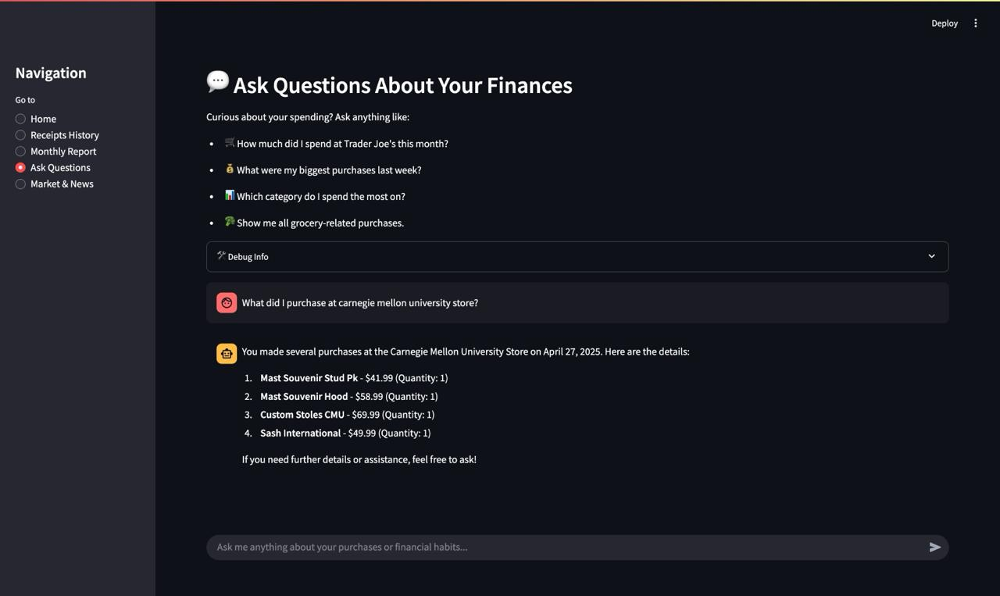

# 🌿 Sticklet: A Personal Receipt Journal 🐶


<p align="center">
  <strong>✍️ Authors ✍️</strong><br>
  <strong>Fanxing Bu</strong> &nbsp;|&nbsp; <strong>Ivan Wiryadi</strong><br>
  🎓 Carnegie Mellon University 🎓
</p>

---

## ⚠️ Disclaimer
This repository contains a prototype developed for a course project at Carnegie Mellon University. It is intended for educational and experimental purposes only. It **must not** be relied upon for actual financial decision-making or investment use. It is **not** production-ready.


---

## 🚩 Problem & Motivation

### ❗ Real-World Pain Points
- **Receipts Are Often Ignored, But Rich in Value**  
  Receipts contain essential data for tracking and analysis, yet most are discarded after purchase.

- **Traditional OCR Fails on Real-World Receipts**  
  Layouts and quality vary widely—conventional OCR tools perform poorly without manual correction.

- **Fragmented Financial Tracking**  
  Mobile payment apps only cover partial transactions; users lack a unified financial view.

### ✨ Our Vision
- **Seamless Expense Capture**  
  Just upload a receipt—Sticklet auto-extracts structured data like merchant, items, prices, and timestamps.

- **VLM + LLM = Smarter OCR**  
  Visual-language models (VLM) combined with large language models (LLM) enable robust extraction and adaptive reasoning.

- **Context-Aware Financial Insights**  
  The system uncovers spending trends and suggests budgets, recipes, and forecasts personalized to each user.

---

## 🌟 Key Features

- 📷 **One-Click Receipt Upload** — Upload and parse instantly with no manual steps.
- 🧠 **AI-Powered Extraction (VLM + LLM)** — Accurate parsing of unstructured receipts.
- 💾 **Persistent Purchase Memory** — Structured, searchable logs of your purchase history.
- 📊 **Monthly Report Generation** — Visualizes spending trends and top merchants.
- 💬 **Natural Language Q&A** — Ask: "Where did I spend the most last month?"
- 📰 **Financial News Integration** — Market updates linked to spending habits.
- 📈 **Context-Aware Insights** — Personalized suggestions based on purchase patterns.
- 🧩 **Modular Multi-Agent Design** — Specialized agents for scalability and explainability.

---

## 📚 System Overview
Sticklet is a **multi-agent, AI-enhanced receipt management tool** designed to:

- Extract structured data from real-world receipts
- Maintain a persistent memory of user purchases
- Offer explainable insights and reports
- Answer user questions in natural language
- Contextualize financial news relevant to users

Built using [LangChain](https://www.langchain.com/), [Mistral AI](https://mistral.ai/), and [Streamlit](https://streamlit.io/) for an interactive experience.

---

## 🧱 Project Structure
```
agentic-project/
├── app.py                     # Main app entry point
├── data/                      # Storage layer
├── src/
│   ├── agents/                # Autonomous agents
│   ├── tools/                 # OCR, memory, news tools
│   └── utils/                 # Utilities and memory
├── streamlit_app/            # Frontend (Streamlit)
└── tests/                    # Unit tests and sample receipts
```

---

## 🧠 Core Components
### 🤖 Agents
- **Coordinator Agent** — Manages all user interactions and delegates tasks
- **Receipt Reader Agent** — Uses OCR + parsing for image analysis
- **Monthly Report Agent** — Summarizes expense history
- **Market Agent** — Retrieves & summarizes market news

### 🛠 Tools
- `receipt_tools.py` — Receipt OCR + text parsing
- `memory_tools.py` — Memory access + insights
- `receipt_processor_tool.py` — Data validation + storage
- `fetch_market_data.py` — News & financial data retrieval

### 💾 Memory System
- `Purchase` and `PurchaseItem` schemas
- Supports filtering by date, merchant, category
- Integrates with LangChain memory for agent access

---

## 🤖 Tech Stack Rationale
- **LangChain** — Agent architecture, tool use, memory, and prompt templating
- **Mistral AI** — Visual OCR model for receipt extraction
- **OpenAI** — LLMs for reasoning, summarization, and response generation

---

## 🔁 Example Workflows
### 📤 Receipt Upload
1. Upload receipt image
2. Coordinator calls reader agent
3. Text is extracted → structured → stored

### 📅 Monthly Report
1. Request insights
2. Report agent analyzes history
3. Output: spending trends, top categories

### 📰 News Summary
1. Agent fetches headlines
2. OpenAI summarizes key events
3. Personalizes to user's spending areas

### ❓ Natural Language Q&A
1. Ask financial question
2. Coordinator routes to memory/insight tools
3. Agents answer based on stored data

---

## 🧪 Setup Instructions
```bash
# Install Python 3.13 and dependencies
pip install -r requirements.txt

# Run the app
python app.py

# Set up environment variables
cp .env.example .env
# Add MISTRAL_API_KEY and OPENAI_API_KEY
```

---

## 📸 Screenshots


---

## 📬 Contact
Fanxing Bu & Ivan Wiryadi — Carnegie Mellon University  
Project for Educational Purposes Only 🐶
