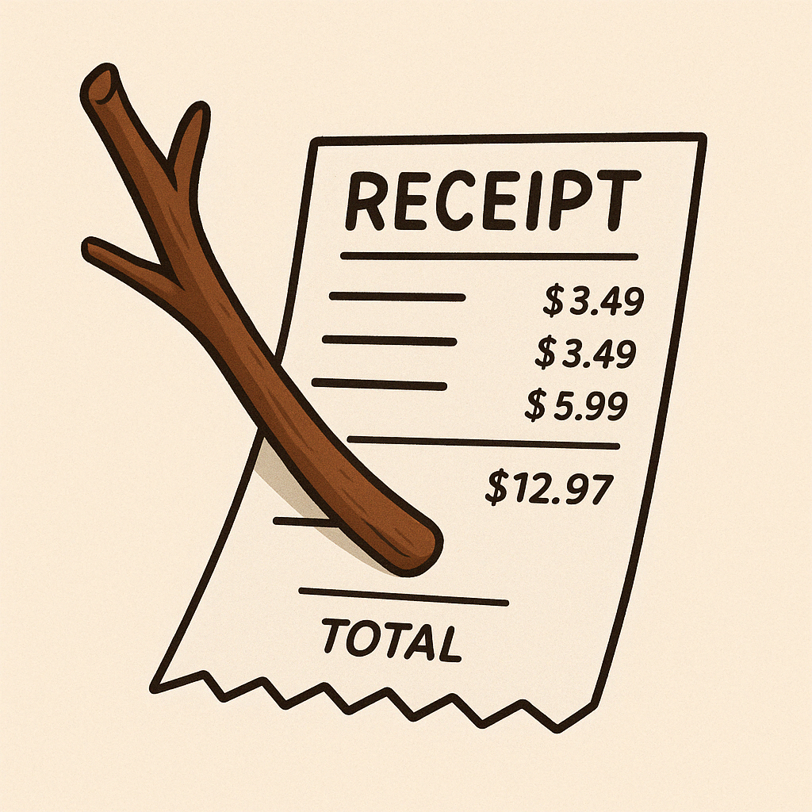
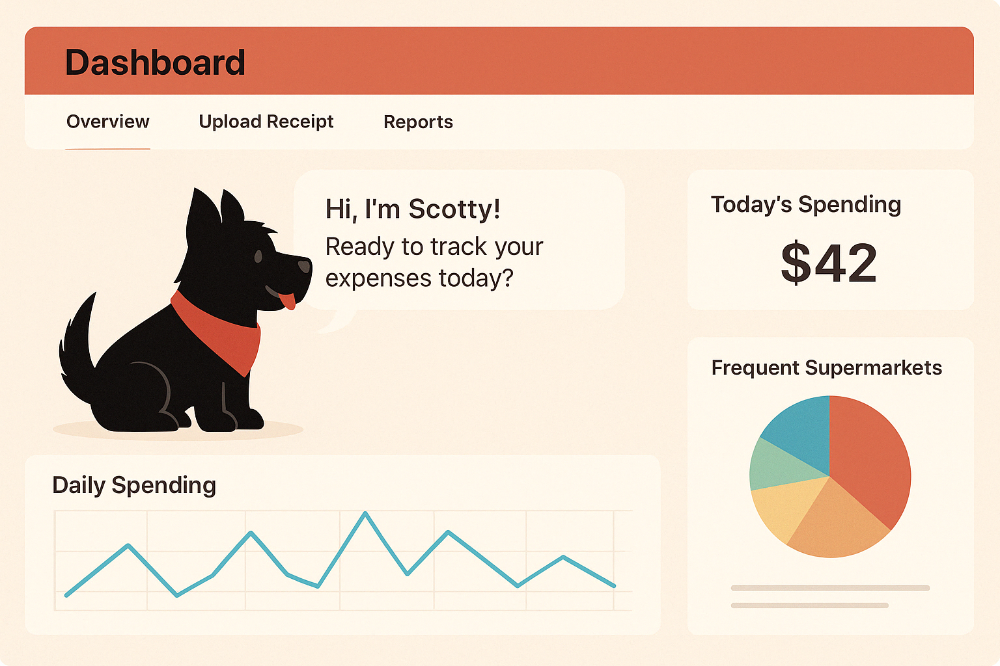
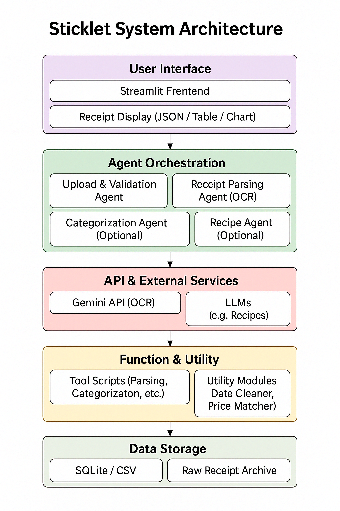

# 🌿 Sticklet: A Personal Receipt Journal by Scotty 🐶


## Introduction

Every time Scotty goes out to play, he brings home a little stick. One by one, he adds them to his cozy little den. Each stick tells a story—a tiny memory in his daily journal.

Just like that, every time **you go out shopping**, you can bring back a **receipt**—your own little “stick.” Just upload an image of your receipt, and Sticklet will automatically record where you shopped, what you bought, and how much you paid. It can even suggest recipes based on your groceries, track price changes over time, and so much more.

✨ Start building Scotty’s little nest—one stick (receipt) at a time.

---

## 1. Project Overview

This project aims to build a multi-agent, LLM-integrated **personal receipt management portal**, now called *Sticklet*.

Users can upload receipt images to input their daily expenses. The system will automatically extract and structure key information using VLM-based OCR and reasoning agents. It reconstructs monthly spending trends, price variation, and consumer preferences. In future versions, the portal can be extended to support financial product tracking, spending tendency analysis, and information querying—enabling end-to-end personal financial assistance.





---

## 2. Agent Design and Modular Architecture

```
[User Upload]
     |
[Upload & Preprocessing Agent]
     |
[Receipt Recognition Agent] --(Gemini API)--> [Structured Receipt JSON]
     |
     +-----------------------------+-----------------------------+-----------------------------+-----------------------------+
     |                             |                             |                             |                             |
[Categorization & Storage Agent]  [Consumption Analysis Agent]  [Preference Insight Agent]   [Recipe Agent](Optional)  [Financial Agent] (Optional)
     |                             |                             |                             |                             |
     v                             v                             v                             v                             v
[Local DB / CSV]       [Monthly Summary / Charts]         [User Trends]                      [RAG]                         [Web]
```


### 1. Upload & Preprocessing Agent
- **Function:** Handles user image upload and validates input format
- **Design Patterns:** Tool Use + Input Validation Pattern

### 2. Vision-Based Receipt Recognition Agent (Gemini API)
- **Function:** Invokes Google Gemini Pro Vision API for OCR and key-value extraction
- **Output:** JSON containing vendor name, transaction date, item list, and total amount
- **Design Patterns:** Perception + Extraction Pattern + Reflection

### 3. Categorization & Storage Agent
- **Function:** Categorizes items by keywords or product types and stores results in local database or CSV
- **Design Pattern:** Memory Pattern

### 4. Consumption Analysis Agent
- **Function:** Generates monthly summaries, top expense categories, and temporal comparisons
- **Design Patterns:** Human Reflection + Multi-Path Plan Generator

### 5. Price Trend & Preference Insight Agent
- **Function:** Analyzes historical item trends and deduces user preferences based on frequency and price fluctuation
- **Design Patterns:** Voting-Based + Debate-Based Reasoning

### 6. Financial Product Management Agent (Optional Extension)
- **Function:** Allows users to manage credit cards, debts, and investments with search and progress tracking
- **Design Patterns:** Tool Use + External RAG

### 7. Smart Recipe Recommendation Agent (Optional Extension)
- **Function:** Recommends personalized recipes based on recent purchases and consumption patterns extracted from receipts (e.g., suggests meals with remaining ingredients or frequent items)
- **Design Patterns:** Preference Recognition + Generative Reasoning + Tool Use

---

## 3. Implementation Plan

### Tech Stack: Python + Gemini API + Streamlit

- **Frontend:** Built with Streamlit for uploading, real-time feedback, and visual analytics
- **Backend:**
  - Image input passed to Gemini Vision API for receipt parsing
  - Rule-based or LLM-enhanced categorization logic
  - SQLite or Pandas DataFrame for storing transaction records
  - Charts generated using matplotlib/seaborn for trend visualization

---

## 4. Future Extensions

- Add financial product search and compliance insights
- Support multi-user, multi-profile configurations (e.g., family budget sharing)
- Recommend vendors or promotions based on consumption history and similarity analysis
- Provide meal planning and recipe suggestions using inferred grocery patterns

---

## 5. Conclusion

This project demonstrates the use of multiple agent design patterns integrated with modern visual-language models to build a structured reasoning and expense-analysis system.

It serves as a foundation for building intelligent financial assistants and can be expanded into a complete personal finance management ecosystem.
