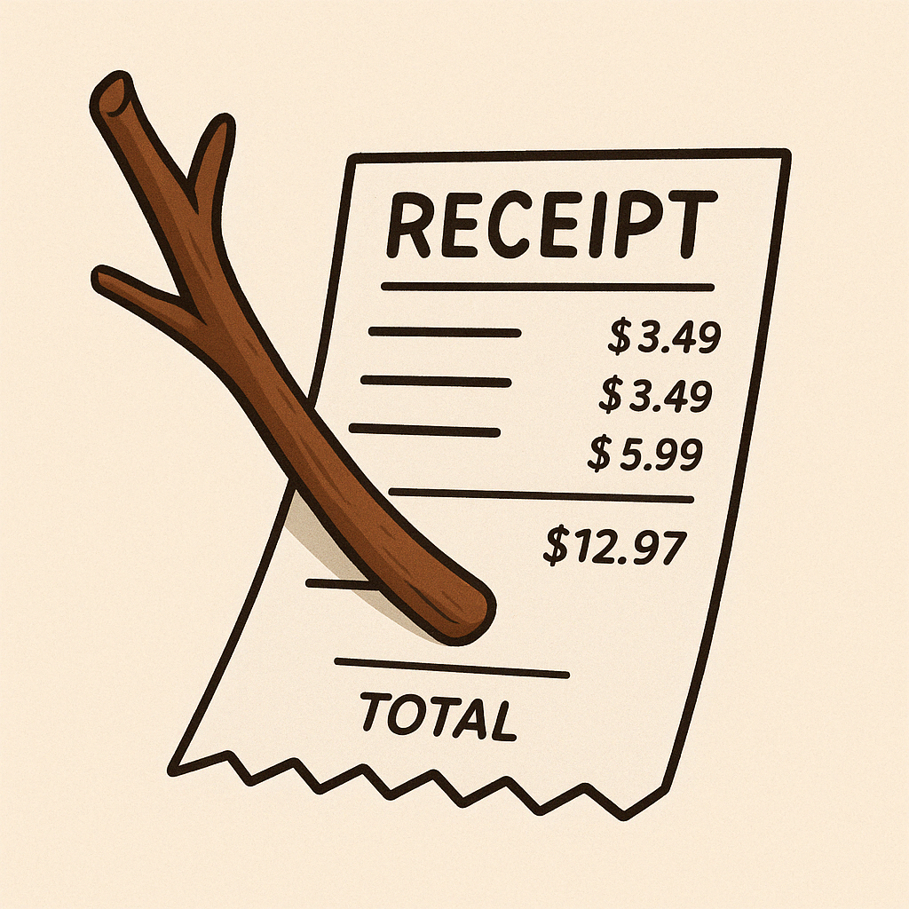
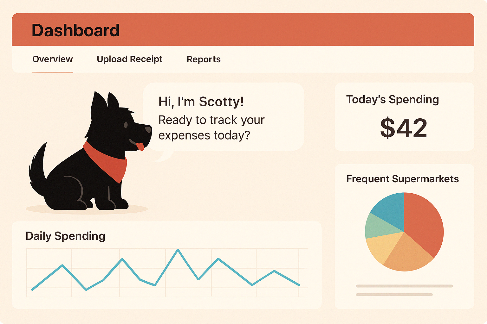

# 🌿 Sticklet: A Personal Receipt Journal by Scotty 🐶

## ⚠️ Disclaimer
This repository contains a prototype developed for a course project. It is intended for educational and experimental purposes only. It **must not** be relied upon for actual financial decision-making or investment use. It is **not** production-ready.


## Setup 

Create a virtual environment and install requirements.txt (Python version used: 3.13)
```
python app.py
```

Then set up your API keys by copying `.env.example`, renaming it to `.env`, and fill in the keys.


## Introduction

Every time Scotty goes out to play, he brings home a little stick. One by one, he adds them to his cozy little den. Each stick tells a story—a tiny memory in his daily journal.


Just like that, every time **you go out shopping**, you can bring back a **receipt**—your own little “stick.” Just upload an image of your receipt, and Sticklet will automatically record where you shopped, what you bought, and how much you paid. It can even suggest recipes based on your groceries, track price changes over time, and so much more.

✨ Start building Scotty’s little nest—one stick (receipt) at a time.

---

## 1. Project Overview

This project aims to build a multi-agent, LLM-integrated **personal receipt management portal**, now called *Sticklet*.

Users can upload receipt images to input their daily expenses. The system will automatically extract and structure key information using VLM-based OCR and reasoning agents. It reconstructs monthly spending trends, price variation, and consumer preferences. In future versions, the portal can be extended to support financial product tracking, spending tendency analysis, and information querying—enabling end-to-end personal financial assistance.





---

## Project Overview

This is a Multi-Agent Personal Financial Portal that uses AI agent design patterns to help users track and analyze their purchases. The system can:

1. Process receipt images using OCR (Optical Character Recognition)
2. Extract structured data from receipts (merchant, items, prices, etc.)
3. Store purchase history
4. Analyze spending patterns and provide financial insights
5. Answer natural language queries about purchase history
6. Retrieve and summarize the latest financial market news

## Project Structure

The codebase follows a modular architecture organized as follows:

```
agentic-project/
├── app.py                     # Main application entry point
├── data/                      # Data storage directory
│   └── purchases.json         # Purchase history database
├── src/
│   ├── agents/
│   │   ├── coordinator_agent.py       # Orchestrates other agents
│   │   ├── receipt_reader_agent.py    # Processes receipt images
│   │   ├── monthly_report_agent.py    # Generates monthly financial summaries
│   │   └── market_agent.py            # Retrieves and summarizes market news
│   ├── tools/
│   │   ├── memory_tools.py            # Tools for accessing memory
│   │   ├── receipt_processor_tool.py  # Tool for processing receipts
│   │   ├── receipt_tools.py           # OCR + parsing
│   │   └── fetch_market_data.py       # Tool to retrieve financial data
│   └── utils/
│       ├── image_utils.py             # Image preprocessing utilities
│       └── memory.py                  # Persistent memory of purchases
├── streamlit_app/
│   └── app.py                # Streamlit web interface
└── tests/
    ├── test_data/            # Sample receipts
    └── unit/                 # Unit tests for core modules
```


## Core Components

### Agents

1. **Coordinator Agent** (`coordinator_agent.py`):  
   - Central entry point for user interactions  
   - Delegates tasks to other agents  
   - Handles query routing and orchestration  

2. **Receipt Reader Agent** (`receipt_reader_agent.py`):  
   - Uses OCR and parsing tools to extract structured data from receipts  

3. **Monthly Report Agent** (`monthly_report_agent.py`):  
   - Analyzes spending patterns  
   - Summarizes monthly financial trends  
   - Detects price changes and category preferences  

4. **Market Agent** (`market_agent.py`):  
   - Retrieves recent financial news and market updates  
   - Uses summarization tools to highlight key insights  

### Tools

1. **Receipt Tools** (`receipt_tools.py`):  
   - `MistralOCRTool`: OCR for image-to-text  
   - `ReceiptParserTool`: Converts raw text into structured purchase info  

2. **Memory Tools** (`memory_tools.py`):  
   - `MemoryTool`: Accesses and filters past purchase data  
   - `InsightGeneratorTool`: Extracts insights (top merchants, frequent items, etc.)  

3. **Receipt Processor Tool** (`receipt_processor_tool.py`):  
   - Validates and stores receipt data  

4. **Fetch Market Data Tool** (`fetch_market_data.py`):  
   - Gathers financial headlines and prices  
   - Feeds data to the Market Agent for summarization  

### Memory

The memory system (`src/utils/memory.py`) stores and manages purchase history:

- Implements the Memory Pattern for persistence
- Uses data classes (`Purchase` and `PurchaseItem`) for type safety
- Provides filtering capabilities (by merchant, date, category)
- Integrates with LangChain's memory system for agent access

## Key Libraries and Why We Use Them

### LangChain

[LangChain](https://www.langchain.com/) is our primary framework for building LLM-powered applications. We use it because:

1. **Agent Architecture**: LangChain provides robust agent frameworks that enable LLMs to use tools, make decisions, and execute multi-step tasks
   - `AgentExecutor`: Manages agent execution and tool usage
   - `create_openai_functions_agent`: Creates OpenAI function-calling agents
   - `create_react_agent`: Creates ReAct-style agents for reasoning and action

2. **Memory Systems**: LangChain offers memory components that help maintain context
   - `ConversationBufferMemory`: Stores conversation history
   - `SimpleMemory` and `ReadOnlySharedMemory`: Let us share data between components

3. **Prompt Management**: LangChain's prompt templates make it easy to create consistent interactions with LLMs
   - `ChatPromptTemplate` and `MessagesPlaceholder`: Structure agent prompts
   - System messages and human messages: Create proper conversation context

4. **Tool Integration**: LangChain's tools framework makes it easy to extend agent capabilities
   - `BaseTool`: Base class for all our custom tools
   - Tool registration: Automatically makes tools available to agents

### Mistral AI

We use [Mistral AI](https://mistral.ai/) for:

1. **OCR Capabilities**: Extract text from images through their OCR model
2. **LLM Models**: Process extracted text and generate structured data
3. **Multi-modal Understanding**: Process both text and images in a single API call

### OpenAI

We use [OpenAI](https://openai.com/) models for:

1. **Natural Language Understanding**: Process user queries about their finances
2. **Agent Orchestration**: The coordinator agent uses OpenAI models for high-level reasoning
3. **Financial Insights**: Generate useful financial insights from purchase history

## Agent Design Patterns

Our system implements several agent design patterns:

1. **Coordinator Pattern**: The coordinator agent orchestrates specialized agents to solve complex tasks

2. **Tool Use Pattern**: Agents use specialized tools to extend their capabilities beyond just text generation

3. **Memory Pattern**: The system maintains persistent memory of purchase history and user interactions

4. **ReAct Pattern**: Agents follow a "Reasoning and Acting" cycle where they:
   - Think about what to do next
   - Choose an action (tool to use)
   - Observe the result
   - Plan the next step

## Workflow Examples

### Processing a Receipt

When a user submits a receipt image:

1. The coordinator agent receives the image path
2. It delegates to the receipt reader agent
3. The receipt reader uses OCR to extract text from the image
4. The extracted text is parsed into structured data
5. The structured purchase data is stored in memory
6. The purchase data is returned to the user

### Generating Monthly Reports

1. User visits Monthly Insights section  
2. Monthly Report Agent queries past data  
3. Summarizes top merchants, categories, and spending trends  
4. Detects price increases or volume changes over time  

### Summarizing Market News

1. Market Agent triggers `fetch_market_data.py`  
2. Fetches news headlines and relevant stock data  
3. Uses OpenAI to summarize and relate insights to user purchases  

### Answering User Queries

When a user asks about their spending:

1. The coordinator agent processes the natural language query
2. It determines what information is needed
3. It uses the memory tool to access relevant purchase data
4. It formulates a helpful response based on the retrieved data
5. For complex insights, it may use the insight generator tool


## Getting Started

To set up your development environment:

1. Install dependencies: `pip install -r requirements.txt`
2. Set up environment variables:
   - `MISTRAL_API_KEY`: Your Mistral AI API key
   - `OPENAI_API_KEY`: Your OpenAI API key
3. Run the application: `python app.py`
