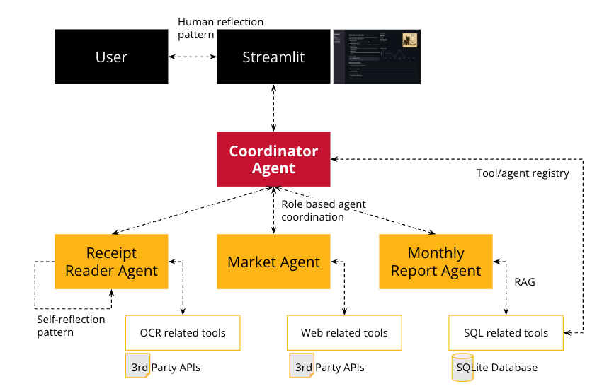

# Research and Planning Report

94-815 Agent Based Modelling and Agentic Technology

Team 8 - Fanxing Bu, Ivan Wiryadi

\newpage

## Project Overview

The base aim for our project is to build an application (portal) using LLM based agents on top of **expense receipt**, called *Sticklet*. The agent is able to extract and store key information from the receipts and use the records to: 

1. Visualize trends and data, e.g. weekly or monthly expenses.
2. Discuss with the user about anything relating to their expenses.

## 1. Overview of Selected Agent Patterns

### 1.1. Human Reflection Pattern

The Human Reflection pattern in Sticklet enables users to validate and correct AI-processed information through the Streamlit interface. In `app.py`, users can review extracted receipt data (merchant name, date, items, prices), make corrections, and confirm before saving to the database. This pattern increases accuracy by allowing humans to correct mistakes in AI processing, which is particularly important for financial data where errors could lead to incorrect insights.

### 1.2. Tool/Agent Registry Pattern

The Tool/Agent Registry pattern is implemented in the `CoordinatorAgent` class which maintains a centralized registry of specialized agents and tools. The coordinator uses `_initialize_agents()` and `_get_agent()` methods to lazily initialize and retrieve specialized agents only when needed. Each specialized agent also has access to its required tools - for example, `ReceiptReaderAgent` has OCR and parsing tools, while `MonthlyReportAgent` has access to SQL tools. This pattern enables resource conservation, provides a clean API for agent access, and facilitates modular development.

### 1.3. Role-Based Agent Coordination Pattern

The Role-Based Agent Coordination pattern distributes specialized tasks to purpose-built agents while the `CoordinatorAgent` orchestrates their activities. Each agent has a distinct role:

- `ReceiptReaderAgent`: Extracts structured data from receipt images
- `MonthlyReportAgent`: Generates financial reports based on spending history
- `MarketAgent`: Retrieves and analyzes market information

The coordinator delegates specific tasks to these specialized agents through methods like `process_receipt()`, `gen_monthly_report()`, and `get_market_indicators()`. This pattern reduces complexity through separation of concerns, allows for specialized optimizations in each agent, and enables parallel development of different agent capabilities.

### 1.4. Self-Reflection Pattern

The Self-Reflection pattern is implemented in the `ReceiptReaderAgent` through the `_reflect_on_results()` method, which validates and potentially corrects extracted data. When processing receipts, the agent extracts data and then "reflects" on whether the results make sense. For example, it identifies generic merchant names like "receipt" or "store" and attempts to find more specific merchant names from the raw text. It also validates dates and item categories. This pattern improves data quality by identifying and correcting common errors, reducing the need for human intervention, and learning from past mistakes.

### 1.5. Retrieval Augmented Generation (RAG) Pattern

The RAG pattern enhances the agent's knowledge with external data from the SQLite database. The system uses `PurchaseMemory` to store structured purchase data and provides tools like `SQLQueryTool` to query this database. When users ask questions about their spending patterns, the agent can retrieve relevant transaction data to provide personalized responses rather than relying solely on its pre-trained knowledge. This pattern enables the foundation model to access domain-specific knowledge, provide personalized responses based on user data, and perform temporal analysis of spending patterns without needing to retrain the model.

## 2. Tool Comparison and Selection Rationale

TBD

## 3. Conceptual Design and Use Cases
The core function of Sticklet is to scan and transform receipt images into structured data that augments the personal financial agent. Users are able to upload receipt images through the web interface, which is then processed to extract information such as merchant, transaction date, total amount, the items purchased, etc and store them into persistent database. Using these data, the agent can help to provide relevant information about the users expenses. 

### 3.1 Use Case: Natural Language Financial Queries
Users can interact with Sticklet through natural language questions about their spending habits and financial patterns. The `CoordinatorAgent` processes these queries by translating them into appropriate database operations using tools like `SQLQueryTool` and `InsightGeneratorTool`. The system can answer questions ranging from simple lookups ("How much did I spend at Trader Joe's?") to complex analyses ("How has the price of white rice that I bought changed over time?"). This enables users to gain insights about their finances without needing to know specialized query languages or spreadsheet operations.

### 3.2 Use Case: Monthly Reporting & Analysis
Sticklet generates comprehensive monthly reports that provide users with an overview of their spending patterns. The `MonthlyReportAgent` aggregates all transaction data for a specified month, calculates totals by category and merchant, identifies high-spend days, and generates narrative summaries using the Mistral API. These reports include both quantitative data visualizations (spending trends, category breakdowns) and qualitative analysis (patterns, anomalies, recommendations), giving users actionable insights about their financial behavior without requiring manual data compilation.

### 3.3 Use Case: Market Intelligence Integration
The Market Agent connects personal finance data with broader market context by tracking major market indices (S&P 500, Dow Jones, NASDAQ) and generating tailored market summaries. Users can view 7-day historical market data and receive AI-generated narratives that explain market movements. This integration helps users understand how external economic factors might impact their personal finances and make more informed decisions about future spending or investments.